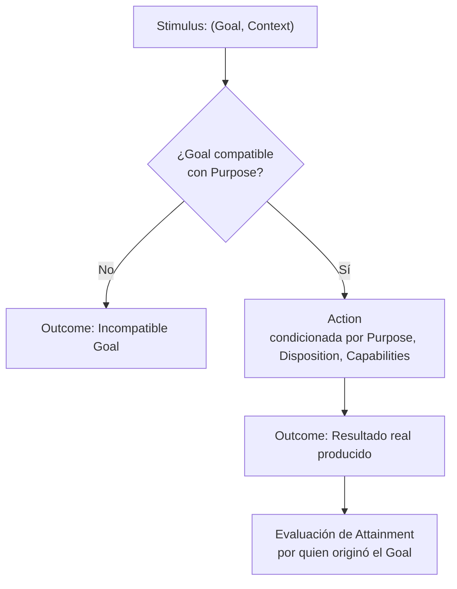

# UCA — Unidad Cognitiva Autónoma (Autonomous Cognitive Unit)

[](LICENSE)
[](SPECIFICATION.es.md)

[ [English](README.md) | Español ] &nbsp;•&nbsp; [ [Specification (EN)](SPECIFICATION.md) | [Especificación (ES)](SPECIFICATION.es.md) ]

> **Una UCA no se define por lo que ejecuta, sino por el propósito que es responsable de alcanzar.**
>
> *An Autonomous Cognitive Unit is defined not by the algorithm it executes, the model it uses, or the data it processes, but by why it exists within the cognitive system.*

---

## 📖 Resumen Ejecutivo

Muchas arquitecturas contemporáneas de agentes de Inteligencia Artificial se apoyan en un patrón monolítico:
```text
Input ──► Estado Central / Snapshot ──► Prompt con Gran Contexto ──► Modelo Central ──► Output
```
Este patrón suele concentrar responsabilidades dispares en estructuras globales masivas y delega la planificación, coordinación y resolución de errores exclusivamente en inferencias de modelos individuales.

La especificación abierta **UCA (Unidad Cognitiva Autónoma)** define una abstracción minimalista orientada a propósitos:
- **Autonomía en el Purpose**: La funcionalidad cognitiva se divide según propósitos autónomos y acotados (`Purpose`).
- **Reactividad en la ejecución**: Una UCA actúa estrictamente ante un Stimulus recibido (`Stimulus = Goal + Context`).
- **Comportamiento Emergente (Hipótesis)**: El comportamiento cognitivo puede emerger de la interacción contextual entre unidades acotadas por propósito. Esta es una hipótesis a validar experimentalmente, no una propiedad demostrada.
- **Adaptación estructural sin reentrenamiento**: Las Dispositions pueden adaptarse en respuesta a retroalimentación operacional, modificando la conducta futura sin alterar código fuente ni reentrenar pesos.

---

## 🧩 De Primitiva a Comportamiento Emergente

> **Una UCA no es cognición.**
>
> **Una UCA es una primitiva funcional mínima propuesta para componer sistemas en los que el comportamiento cognitivo puede emerger.**

```text
┌──────────────────────────────┐
│             UCA              │  ← primitiva funcional (normativa)
│  U = (P, D, C)              │
│  (U, S) → A → O             │
└──────────────┬───────────────┘
               │ composición
               ▼
┌──────────────────────────────┐
│       SISTEMA DE UCAs        │  ← red de primitivas funcionales
│   U₁ ↔ U₂ ↔ ... ↔ Uₙ       │
└──────────────┬───────────────┘
               │ organización
               ▼
┌──────────────────────────────┐
│    COGNITIVE ARCHITECTURE    │  ← organización de primitivas
└──────────────┬───────────────┘
               │ ejecutado por
               ▼
┌──────────────────────────────┐
│           RUNTIME            │  ← infraestructura de ejecución
└──────────────────────────────┘
```

Y de forma separada, como hipótesis de investigación:

```text
SISTEMA DE UCAs
       │
       │ hipótesis experimental
       ▼
EMERGENT COGNITIVE BEHAVIOUR
```

---

## ⚖️ Especificación frente a Implementación

Esta especificación abierta define el contrato conceptual de una Unidad Cognitiva Autónoma.

**La especificación define deliberadamente**:
- Qué constituye una UCA;
- Cómo se activa una UCA;
- Cómo realiza una Action y produce un Outcome;
- Las invariantes que gobiernan la composición y el alcance acotado.

**La especificación NO prescribe**:
- Una topología cognitiva o jerarquía obligatoria;
- Unidades cognitivas específicas que todo sistema deba instanciar;
- Analogías biológicas o neuroanatómicas;
- Una tecnología de comunicación o broker de mensajes particular;
- Un modelo de lenguaje, framework o proveedor específico;
- Un motor de memoria o base de datos concreto;
- Una representación centralizada de estado global;
- Un entorno de ejecución específico;
- Que ninguna UCA individual posea o demuestre cognición.

---

## 🔬 Modelo Conceptual Mínimo (UCA Core)

Una UCA se compone persistentemente de:
```text
U = (P, D, C)
```
Donde:
- **`P` (Purpose)**: Por qué existe la UCA — identidad estable e independiente de la implementación.
- **`D` (Disposition)**: Conjunto de condiciones constitutivas (`Configuration`) y paramétricas (`Parametrization`) que predisponen cómo se comportan sus capacidades mediante sus mecanismos para cumplir su Purpose. La Disposition efectiva de una UCA emerge de la composición y armonización de las Dispositions de sus capacidades constitutivas.
- **`C` (Capabilities)**: Recursos accesibles (algoritmos, herramientas, modelos, otras UCAs). Una UCA puede utilizar otras UCAs como Capabilities cuando sus Purposes autónomos proporcionan la funcionalidad requerida por su Action. La composición es recursiva y no requiere un coordinador central.

Una activación se define por:
```text
S = (G, X)
```
Donde:
- **`G` (Goal)**: Resultado objetivo para esta activación. Un Goal debe ser compatible con el Purpose.
- **`X` (Context)**: Información contextual requerida para interpretar y alcanzar `G`.

El modelo mínimo de activación:
```text
(U, S) → A → O
```
Donde:
- **`A` (Action)**: Lo que la UCA realiza, condicionado por Purpose, Disposition, Capabilities, Goal y Context.
- **`O` (Outcome)**: Lo que la Action produjo realmente (*pertenece a la unidad ejecutora*).

> El Outcome pertenece a quien ejecuta.
> El Attainment pertenece a quien originó el Goal.

### Flujo Canónico de Activación



---

## 📜 Invariantes Fundamentales

1. **Principio de Purpose**: Una UCA se define por un Purpose (`P`) autónomo y estable.
2. **Principio de Especialización**: Una UCA solo acepta Goals compatibles con su Purpose.
3. **Principio de Reactividad Local**: Ninguna UCA se autoactiva; opera estrictamente ante un Stimulus (`S`).
4. **Principio de Composición**: Una UCA puede utilizar otra UCA como Capability (composición recursiva).
5. **Principio de Terminación**: Cuando dejan de emerger propósitos autónomos y solo restan mecanismos, se han alcanzado capacidades terminales.
6. **Principio de Outcome**: Una UCA produce Outcomes reales; no se autoevalúa en abstracto.
7. **Principio de Attainment**: El Outcome pertenece a quien ejecuta; el Attainment a quien originó el Goal.
8. **Invarianza del Purpose**: Una UCA no puede alterar su propio Purpose, ya que destruiría su identidad funcional.
9. **Principio de Representación**: Poseer el dato producido por una capacidad cognitiva no equivale a poseer la capacidad que lo genera.
10. **Principio de Minimalidad**: Un concepto pertenece al UCA Core solo si eliminarlo impide que la unidad satisfaga el contrato UCA universal.
11. **Principio de Composición Cognitiva**: Antes de extender la primitiva UCA, intentar representar la funcionalidad cognitiva requerida mediante composición de UCAs existentes.

---

## ✅ Criterios Mínimos de Conformidad (Conformance)

Un componente de software cumple con el **UCA Core** si y solo si:

1. Define un **Purpose** (`P`) explícito, estable e independiente de la implementación.
2. Tiene una **Disposition** (`D`) que condiciona su comportamiento.
3. Opera mediante un conjunto explícito de **Capabilities** (`C`).
4. Se ejecuta estrictamente al recibir un **Stimulus** activador (`S`).
5. El Stimulus contiene un **Goal** (`G`) y un **Context** (`X`).
6. Acepta Goals solo cuando son compatibles con su **Purpose**.
7. Realiza una **Action** (`A`) dirigida hacia el Goal dentro de su Purpose.
8. Produce un **Outcome** (`O`) que representa lo que la Action produjo efectivamente.
9. Trata a otro componente como UCA solo si dicho componente posee su propio Purpose autónomo.

**No-requisitos para la conformidad**: Una implementación *no* requiere Observation ni Perception como fases del ciclo de vida, Memory, Identity, Learning, Adaptation, un Coordinador, Dispatcher, Orquestador o Supervisor, un LLM, causalidad externa, un sobre Impulse, un Event Bus, un snapshot de estado global, Sinapsis, ni comportamiento cognitivo emergente demostrado para ser conforme con UCA.

La conformidad evalúa la **unidad individual** frente al contrato UCA. No evalúa si el sistema en su conjunto exhibe comportamiento cognitivo.

---

## 🔬 La Hipótesis Falsable

> **¿Puede emerger comportamiento cognitivo de la interacción de UCAs acotadas por propósito, mientras cada unidad individual permanece estructuralmente limitada a `U = (P, D, C)` y conductualmente limitada a `(U, S) → A → O`?**

Esta pregunta es la hipótesis experimental central que plantea UCA. Debe poder evaluarse mediante futuras implementaciones y observación empírica.

---

## 📚 Documentación Formal Completa

- 🇪🇸 **[SPECIFICATION.es.md (Español)](SPECIFICATION.es.md)** — Especificación formal completa en español (RFC).
- 🇬🇧 **[SPECIFICATION.md (English)](SPECIFICATION.md)** — Exhaustive normative specification in English.

---

## Licencia

UCA Specification © 2026 Christian Marino Alvarez.

Esta especificación y su documentación están licenciadas bajo la
Licencia Creative Commons Atribución 4.0 Internacional (CC BY 4.0).

Eres libre de usar, compartir, adaptar e implementar esta especificación,
incluso con fines comerciales, siempre que se proporcione la atribución adecuada.

Las implementaciones de software y los runtimes de referencia se licencian por separado.
