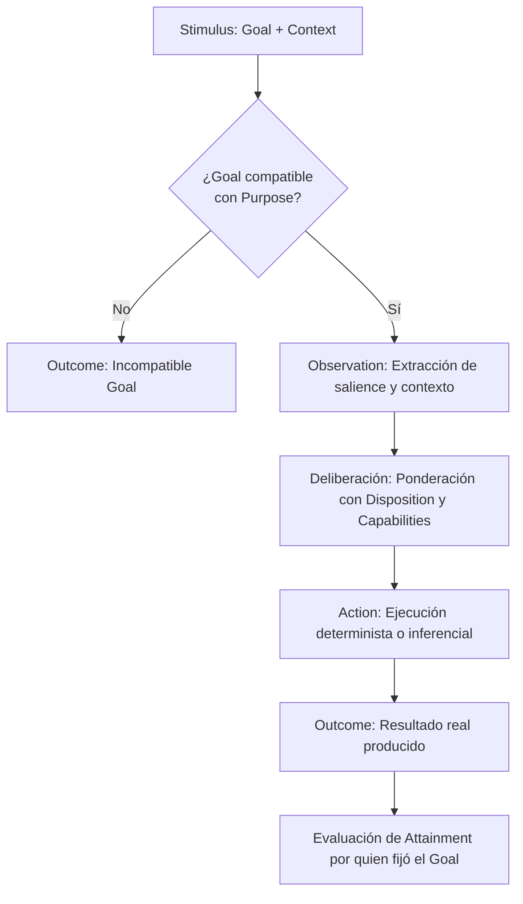

# UCA — Unidad Cognitiva Autónoma (Autonomous Cognitive Unit)

[](LICENSE)
[](SPECIFICATION.es.md)

[ [English](README.md) | Español ] &nbsp;•&nbsp; [ [Specification (EN)](SPECIFICATION.md) | [Especificación (ES)](SPECIFICATION.es.md) ]

> **Una UCA no se define por lo que ejecuta, sino por el propósito que es responsable de alcanzar.**
>
> *An Autonomous Cognitive Unit is defined not by the algorithm it executes, the model it uses, or the data it processes, but by why it exists within the cognitive system.*

---

## 📖 Resumen Ejecutivo

Muchas arquitecturas contemporáneas de agentes de Inteligencia Artificial se apoyan en un patrón monolítico:
```text
Input ──► Estado Central / Snapshot ──► Prompt con Gran Contexto ──► Modelo Central ──► Output
```
Este patrón suele concentrar responsabilidades dispares en estructuras globales masivas y delega la planificación, coordinación y resolución de errores exclusivamente en inferencias de modelos individuales.

La especificación abierta **UCA (Unidad Cognitiva Autónoma)** define una abstracción minimalista orientada a propósitos:
- **Autonomía en el Purpose**: La funcionalidad cognitiva se divide según propósitos autónomos y acotados (`Purpose`).
- **Reactividad en la ejecución**: Una UCA actúa estrictamente ante un estímulo recibido (`Stimulus = Goal + Context`).
- **Cognición emergente**: La cognición no reside en un único modelo central; **emerge de la interacción contextual** entre unidades especializadas.
- **Adaptación estructural sin reentrenamiento**: Las disposiciones (`Dispositions`) pueden adaptarse en respuesta a la retroalimentación operacional, modificando la conducta futura sin alterar código fuente ni reentrenar pesos.

---

## 🏛️ La Arquitectura en Tres Niveles

Para preservar un contrato mínimo y universal, la especificación separa estrictamente tres niveles:

```text
┌─────────────────────────────────────────────────────────────────┐
│                           UCA CORE                              │
│  Define qué es una UCA: identidad, contratos y activación.      │
│  U = (P, D, C)  |  S = (G, X)  |  compat(P, G)  |  O = F_U(S)   │
└────────────────────────────────┬────────────────────────────────┘
                                 │
                                 ▼
┌─────────────────────────────────────────────────────────────────┐
│                    COGNITIVE ARCHITECTURE                       │
│  Define cómo un sistema organiza y compone múltiples UCAs:     │
│  Coordinación, supervisión, distribución de estado, causalidad. │
└────────────────────────────────┬────────────────────────────────┘
                                 │
                                 ▼
┌─────────────────────────────────────────────────────────────────┐
│                            RUNTIME                              │
│  Define la infraestructura de ejecución y transporte:           │
│  Sobres Impulse, protocolos de mensajería, concurrencia, trazas.│
└─────────────────────────────────────────────────────────────────┘
```

Una unidad funcional es una UCA si y solo si satisface el **UCA Core**. La Arquitectura Cognitiva y el Runtime son decisiones de implementación y organización.

---

## ⚖️ Especificación frente a Implementación

Esta especificación abierta define el contrato conceptual de una Unidad Cognitiva Autónoma.

**La especificación define deliberadamente**:
- Qué constituye una UCA;
- Cómo se activa una UCA;
- Cómo delibera, ejecuta acciones y produce resultados;
- Las invariantes que gobiernan la composición y el alcance acotado.

**La especificación NO prescribe**:
- Una topología cognitiva o jerarquía obligatoria;
- Unidades cognitivas específicas que todo sistema deba instanciar;
- Analogías biológicas o neuroanatómicas;
- Una tecnología de comunicación o broker de mensajes particular;
- Un modelo de lenguaje, framework o proveedor específico;
- Un motor de memoria o base de datos concreto;
- Una representación centralizada de estado global;
- Un entorno de ejecución (runtime) específico.

Cualquier sistema puede implementar los conceptos de UCA utilizando diferentes lenguajes de programación, modelos de actores, buses de eventos, runtimes distribuidos, modelos locales o remotos, y diversas topologías organizativas.

---

## 🔬 Modelo Conceptual Mínimo (UCA Core)

Una UCA se compone persistentemente de:
```text
U = (P, D, C)
```
Donde:
- **$P$ (Purpose)**: Por qué existe la UCA (identidad estable e independiente de la implementación).
- **$D$ (Disposition)**: Predisposiciones de comportamiento (umbrales de confianza, tolerancia a ambigüedad, sesgos).
- **$C$ (Capabilities)**: Recursos accesibles (algoritmos, herramientas, modelos, UCAs subordinadas).

Una activación se define por:
```text
S = (G, X)
```
Donde:
- **$G$ (Goal)**: Resultado objetivo para esta activación ($\text{compat}(P, G) = \text{true}$).
- **$X$ (Context)**: Información contextual requerida para interpretar y alcanzar $G$.

La ejecución produce:
```text
O = F_U(S) = F(P, D, C, G, X)
```
Donde:
- **$O$ (Outcome)**: Lo que la acción ejecutada produjo realmente (*pertenece a la unidad ejecutora*).

Attainment ($T$):
> El Outcome pertenece a quien ejecuta.
> El Attainment pertenece a quien originó el Goal.

### Flujo Canónico de Activación



---

## 📜 Invariantes Fundamentales

1. **Principio de Purpose**: Una UCA se define por un Purpose ($P$) autónomo y estable.
2. **Principio de Especialización**: Una UCA solo acepta Goals compatibles con su Purpose ($\text{compat}(P, G) = \text{true}$).
3. **Principio de Reactividad Local**: Ninguna UCA se autoactiva; opera estrictamente ante un Stimulus ($S$).
4. **Principio de Composición**: Una UCA puede utilizar otra UCA como Capability (composición recursiva).
5. **Principio de Terminación**: Cuando dejan de emerger propósitos autónomos y solo restan mecanismos, se han alcanzado capacidades terminales.
6. **Principio de Outcome**: Una UCA produce Outcomes reales; no se autoevalúa en abstracto.
7. **Principio de Attainment**: El Outcome pertenece a quien ejecuta; el Attainment a quien originó el Goal.
8. **Invarianza del Purpose**: Una UCA no puede alterar su propio Purpose, ya que destruiría su identidad funcional.
9. **Principio de Representación**: Poseer el dato producido por una capacidad cognitiva no equivale a poseer la capacidad que lo genera.

---

## ✅ Criterios Mínimos de Conformidad (Conformance)

Un componente de software cumple con el **UCA Core** si y solo si:

1. Define un **Purpose** ($P$) explícito, estable e independiente de la implementación.
2. Acepta **Goals** ($G$) solo cuando son compatibles con su Purpose ($\text{compat}(P, G) = \text{true}$).
3. Se ejecuta estrictamente al recibir un **Stimulus** activador ($S$).
4. Consume el **Context** ($X$) requerido para su activación.
5. Opera mediante un conjunto explícito de **Capabilities** ($C$).
6. Su razonamiento o selección de acción puede estar condicionado por una **Disposition** ($D$).
7. Ejecuta una **Action** ($A$) orientada hacia el Goal.
8. Produce un **Outcome** ($O$) que representa lo que la acción produjo efectivamente.
9. Trata a otro componente como UCA solo si dicho componente posee su propio Purpose autónomo.

**No-requisitos para la conformidad**: Una implementación *no* requiere un sobre Impulse, un Event Bus, un LLM, causalidad externa obligatoria, un snapshot de estado global ni un coordinador o supervisor centralizado para ser conforme con UCA.

---

## 📚 Documentación Formal Completa

- 🇪🇸 **[SPECIFICATION.es.md (Español)](SPECIFICATION.es.md)** — Especificación formal completa en español (RFC).
- 🇬🇧 **[SPECIFICATION.md (English)](SPECIFICATION.md)** — Exhaustive normative specification in English.

---

## Licencia

UCA Specification © 2026 Christian Marino Alvarez.

Esta especificación y su documentación están licenciadas bajo la
Licencia Creative Commons Atribución 4.0 Internacional (CC BY 4.0).

Eres libre de usar, compartir, adaptar e implementar esta especificación,
incluso con fines comerciales, siempre que se proporcione la atribución
adecuada.

Las implementaciones de software y los runtimes de referencia se licencian por separado.
