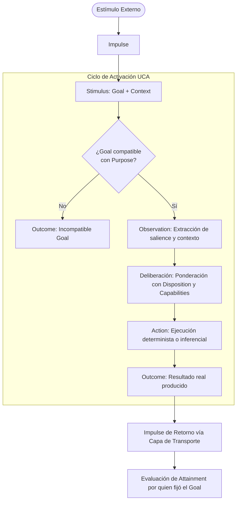

# UCA — Unidad Cognitiva Autónoma (Autonomous Cognitive Unit)

[](LICENSE)
[](SPECIFICATION.es.md)

[ [English](README.md) | Español ] &nbsp;•&nbsp; [ [Specification (EN)](SPECIFICATION.md) | [Especificación (ES)](SPECIFICATION.es.md) ]

> **Una UCA no se define por lo que ejecuta, sino por el propósito que es responsable de alcanzar.**
>
> *An Autonomous Cognitive Unit is defined not by the algorithm it executes, the model it uses, or the data it processes, but by why it exists within the cognitive system.*

---

## 📖 Resumen Ejecutivo

Muchas de las arquitecturas de agentes de Inteligencia Artificial actuales se apoyan en un patrón monolítico:
```text
Input ──► Estado Central / Snapshot ──► Prompt con Gran Contexto ──► Modelo Central ──► Output
```
Este patrón suele concentrar responsabilidades dispares en estructuras globales masivas y delega la deliberación, coordinación y resolución de errores en llamadas opacas a modelos de lenguaje.

La arquitectura **UCA (Unidad Cognitiva Autónoma)** propone una alternativa modular orientada a propósitos:
- **Autonomía en el Purpose**: Cada unidad existe para satisfacer un propósito cognitivo autónomo y acotado (`Purpose`).
- **Reactividad en la ejecución**: Ninguna UCA se autoactiva; actúa estrictamente ante un estímulo recibido (`Stimulus = Goal + Context`).
- **Cognición emergente**: La cognición no reside en una única unidad central ni en un modelo monolítico; **emerge de la interacción causal y contextual** entre unidades especializadas ($UCA_1, UCA_2, UCA_3$).
- **Adaptación estructural sin reentrenamiento**: La interacción con el entorno exterior aporta evidencia que permite a unidades supervisoras diagnosticar desviaciones y adaptar las predisposiciones de comportamiento (`Dispositions`) de otras unidades, modificando la conducta futura sin alterar código ni reentrenar pesos.

> **Nota de Alcance**: Este repositorio documenta el modelo abstracto UCA. Está diseñado de forma estrictamente agnóstica respecto a runtimes específicos, frameworks o analogías con órganos biológicos.

---

## 🏛️ Modelo Conceptual Mínimo

Una UCA se compone persistentemente de:
```text
UCA
├── Purpose       (Por qué existe — persistente, independiente de la implementación)
├── Disposition   (Predisposiciones de comportamiento — adaptables externamente)
└── Capabilities  (Recursos disponibles: algoritmos, herramientas, modelos, otras UCAs)
```

### El Ciclo de Activación Canónico

Una UCA reacciona únicamente cuando recibe un **Estímulo**:



---

## 📐 Conceptos Clave

| Concepto | Definición |
|---|---|
| **Purpose** | Expresa **por qué existe** una UCA. Estable, independiente de una ejecución concreta. |
| **Goal** | Qué **resultado concreto** necesita obtenerse en una activación determinada. Contextual y efímero. |
| **Stimulus** | La activación cognitiva de una UCA. Contiene el `Goal` y el `Context`. |
| **Impulse** | El vehículo de transporte en la capa de comunicación (id, ttl, traceId, prioridad, stimulus/outcome). |
| **Context** | La información relevante necesaria para interpretar el Goal (evidencias, outcomes previos). |
| **Observation** | La información cognitivamente relevante que la UCA extrae de la entrada. |
| **Disposition** | Predisposiciones de comportamiento (tolerancia a ambigüedad, umbrales de inferencia, etc.). |
| **Capability** | Recursos instrumentales que una UCA puede invocar (algoritmos, LLMs, drivers, o **otras UCAs**). |
| **Action** | La ejecución concreta que intenta satisfacer el Goal bajo su Purpose. |
| **Outcome** | Lo que **realmente produjo** la acción (*pertenece a quien ejecuta*). |
| **Attainment** | Grado en que el Outcome satisface la necesidad original (*pertenece a quien estableció el Goal*). |

---

## 📜 Principios Fundamentales

1. **Principio de Purpose**: Una UCA existe porque posee un propósito autónomo y estable.
2. **Principio de Especialización**: Solo acepta Goals compatibles con su Purpose.
3. **Principio de Reactividad**: No existe autoactivación espontánea; solo opera ante un Stimulus.
4. **Principio de Causalidad Externa**: Toda cadena cognitiva tiene su origen en el exterior del sistema cognitivo.
5. **Principio de Composición**: Una UCA puede utilizar otra UCA como Capability (composición recursiva).
6. **Principio de Terminación**: Cuando dejan de emerger propósitos autónomos y solo restan mecanismos, se han alcanzado capacidades terminales.
7. **Principio de Outcome**: Una UCA produce Outcomes reales; no se autoevalúa en abstracto.
8. **Principio de Attainment**: El Outcome pertenece a quien ejecuta; el Attainment a quien fijó el Goal.
9. **Principio de No Autoadaptación**: Una UCA no altera su propia Disposition; la adaptación procede de una capacidad supervisora independiente.
10. **Principio de Emergencia**: La cognición no reside en una unidad central; emerge de la interacción contextual entre unidades.
11. **Principio de Proactividad**: La autonomía está en el Purpose, la reactividad en la ejecución y la proactividad emerge del encadenamiento causal.
12. **Principio de Representación**: Un dato almacenado no sustituye a la capacidad cognitiva de producirlo.

---

## 🎯 Criterio de Validación Empírica

El modelo UCA se valida si un conjunto reducido de unidades es capaz de:
1. Recibir un estímulo externo;
2. Reaccionar según sus propósitos especializados sin una entidad central omnisciente;
3. Colaborar mediante intercambio de estímulos y resultados;
4. Producir una acción hacia el exterior;
5. Recibir evidencia externa sobre el resultado de dicha acción;
6. Emplear esa evidencia para diagnosticar desviaciones;
7. Adaptar una o más `Dispositions`;
8. **Reaccionar de forma adaptada y correcta ante un escenario futuro equivalente**;
9. Lograrlo **sin alteración de código fuente, sin reentrenamiento de modelos y sin reglas ad-hoc para el caso**.

---

## 📚 Documentación Completa

- 🇪🇸 **[SPECIFICATION.es.md (Español)](SPECIFICATION.es.md)** — Especificación formal completa en español (RFC).
- 🇬🇧 **[SPECIFICATION.md (English)](SPECIFICATION.md)** — Exhaustive normative specification in English.

---

## Licencia

UCA Specification © 2026 Christian Marino Alvarez.

Esta especificación y su documentación están licenciadas bajo la
Licencia Creative Commons Atribución 4.0 Internacional (CC BY 4.0).

Eres libre de usar, compartir, adaptar e implementar esta especificación,
incluso con fines comerciales, siempre que se proporcione la atribución
adecuada.

Las implementaciones de software y los runtimes de referencia se licencian por separado.

