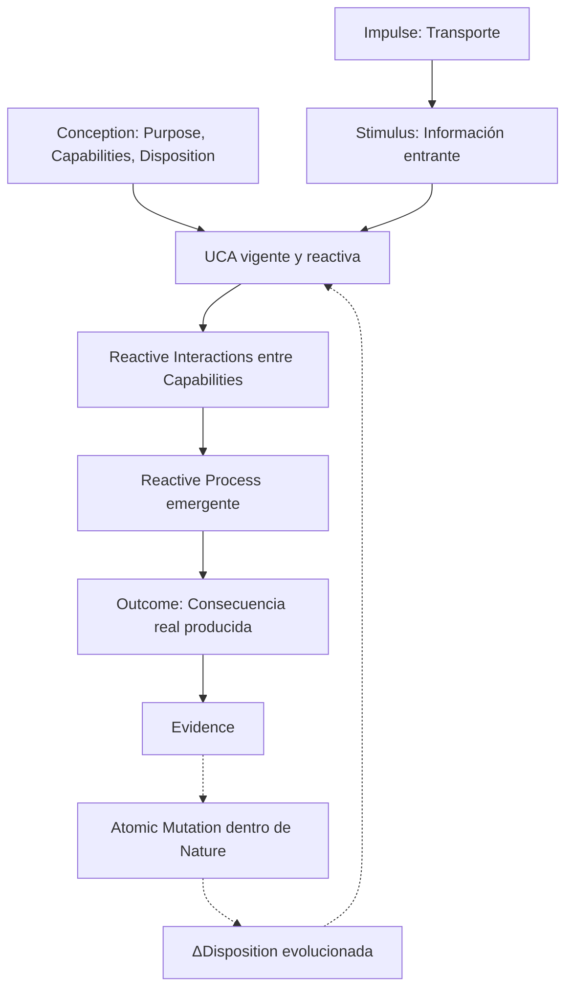

# UCA — Unidad Cognitiva Artificial (Artificial Cognitive Unit)

[](LICENSE)
[](SPECIFICATION.es.md)

[ [English](README.md) | Español ] &nbsp;•&nbsp; [ [Specification (EN)](SPECIFICATION.md) | [Especificación (ES)](SPECIFICATION.es.md) ]

> **Una UCA no se define por lo que ejecuta, sino por el propósito que es responsable de alcanzar.**
>
> *An Artificial Cognitive Unit is defined not by the algorithm it executes, the model it uses, or the data it processes, but by why it exists within the cognitive system.*

---

## 📖 Resumen Ejecutivo

Muchas arquitecturas contemporáneas de agentes de Inteligencia Artificial se apoyan en un patrón monolítico:
```text
Input ──► Estado Central / Snapshot ──► Prompt con Gran Contexto ──► Modelo Central ──► Output
```
Este patrón suele concentrar responsabilidades dispares en estructuras globales masivas y delega la planificación, coordinación y resolución de errores exclusivamente en inferencias de modelos individuales.

La especificación abierta **UCA (Unidad Cognitiva Artificial)** define una abstracción minimalista orientada a propósitos:
- **Propósito Propio y Acotado**: La funcionalidad cognitiva se divide según propósitos propios e invariantes (`Purpose`).
- **Reactividad en la ejecución**: Una UCA actúa estrictamente ante un Stimulus recibido.
- **Comportamiento Emergente (Hipótesis)**: El comportamiento cognitivo puede emerger de la interacción contextual entre unidades acotadas por propósito. Esta es una hipótesis a validar experimentalmente, no una propiedad demostrada.
- **Adaptación estructural sin reentrenamiento**: Las Dispositions pueden adaptarse en respuesta a retroalimentación operacional, modificando la conducta futura sin alterar código fuente ni reentrenar pesos.

---

## 🧩 De Primitiva a Comportamiento Emergente

> **Una UCA no es cognición.**
>
> **Una UCA es una primitiva funcional mínima propuesta para componer sistemas en los que el comportamiento cognitivo puede emerger.**

```text
┌──────────────────────────────┐
│             UCA              │  ← primitiva funcional (normativa)
│  u = (p, d, C)               │
│  (u, s) → a → o              │
└──────────────┬───────────────┘
               │ composición
               ▼
┌──────────────────────────────┐
│       SISTEMA DE UCAs        │  ← red de primitivas funcionales
│   u₁ ↔ u₂ ↔ ... ↔ uₙ         │
└──────────────┬───────────────┘
               │ organización
               ▼
┌──────────────────────────────┐
│    COGNITIVE ARCHITECTURE    │  ← organización de primitivas
└──────────────┬───────────────┘
               │ ejecutado por
               ▼
┌──────────────────────────────┐
│           RUNTIME            │  ← infraestructura de ejecución
└──────────────────────────────┘
```

Y de forma separada, como hipótesis de investigación:

```text
SISTEMA DE UCAs
       │
       │ hipótesis experimental
       ▼
EMERGENT COGNITIVE BEHAVIOUR
```

---

## ⚖️ Especificación frente a Implementación

Esta especificación abierta define el contrato conceptual de una Unidad Cognitiva Artificial.

**La especificación define deliberadamente**:
- Qué constituye una UCA;
- Cómo se activa una UCA;
- Cómo realiza una Action y produce un Outcome;
- Las invariantes que gobiernan la composición y el alcance acotado.

**La especificación NO prescribe**:
- Una topología cognitiva o jerarquía obligatoria;
- Unidades cognitivas específicas que todo sistema deba instanciar;
- Analogías biológicas o neuroanatómicas;
- Una tecnología de comunicación o broker de mensajes particular;
- Un modelo de lenguaje, framework o proveedor específico;
- Un motor de memoria o base de datos concreto;
- Una representación centralizada de estado global;
- Un entorno de ejecución específico;
- Que ninguna UCA individual posea o demuestre cognición.

---

## 🔬 Modelo Conceptual Mínimo (UCA Core)

Una UCA es concebida formalmente como una tupla:
```text
u = (p, d, C) ∈ ℙ × 𝔻 × 𝒫(ℂ)
```
Donde:
- **`p` (Purpose)**: Por qué existe la UCA — identidad persistente e invariante que orienta toda reacción.
- **`d` (Disposition)**: Conjunto de condiciones constitutivas, paramétricas (`Properties`: Function, Nature, Value) e interactivas (`Interactions`: Definition, Target, Signal, When) que determinan cómo sus capacidades están predispuestas para comportarse e interactuar.
- **`C` (Capabilities)**: Recursos operacionales (algoritmos, transforms, herramientas, modelos, otras UCAs) que constituyen los límites funcionales de la unidad ($\forall b \in \text{Behaviors}(u), \text{requiredCapabilities}(b) \subseteq C_u$).

Una activación se define formalmente como:
```text
s ∈ 𝕊
```
Donde:
- **`s` (Stimulus)**: Información o perturbación entrante capaz de provocar una reacción en la UCA pertinente a su Purpose. (El Stimulus transporta los datos o cambios que detonan la reacción; no constituye una segunda dirección teleológica ni requiere un contenedor formal de Context en el Core).

El ciclo de vida fundamental:
```text
Conception ──► u(p, d, C) ──► s ──► Reactive Process (Interactions) ──► Outcome(s)
                              ▲                                          │
                              └──────── Evidence ──► Δd (Nature) ────────┘
```

> El Outcome pertenece a quien ejecuta.
> La evaluación pertenece a quien evalúa o formuló los criterios explícitos.

### Flujo Canónico de Activación y Reactividad



---

## 📜 Principios Fundamentales del Modelo

1. **Conception determina qué UCA existe.**
2. **Purpose determina aquello que la UCA persigue.**
3. **Capabilities determinan los límites de lo que la UCA puede hacer.**
4. **Disposition determina cómo esas Capabilities están constituidas y predispuestas para comportarse e interactuar.**
5. **Stimulus provoca una reacción en una UCA ya concebida.**
6. **Las Capabilities reaccionan mediante Interactions y no mediante dependencias directas entre ellas.**
7. **El Process emerge de las interacciones reactivas entre Capabilities conforme a sus Dispositions.**
8. **Outcome es la consecuencia observable de dicha actividad.**
9. **Evolution modifica la Disposition sin abandonar el Purpose ni los límites de las Capabilities.**
10. **La unidad mínima de Evolution es una Mutation atómica, limitada, observable y potencialmente reversible.**

---

## ✅ Criterios Mínimos de Conformidad (Conformance)

Un componente de software cumple con el **UCA Core** si y solo si:

1. Define un **Purpose** (`P`) propio, explícito, estable e independiente de la implementación.
2. Tiene una **Disposition** (`D`) declarativa que condiciona su comportamiento e interacciones.
3. Opera mediante un conjunto explícito y acotado de **Capabilities** (`C`).
4. Se ejecuta estrictamente al recibir un **Stimulus** activador (`S`) pertinente a su Purpose.
5. Realiza una **Action** (`A`) que persigue su Purpose dentro de los límites de sus Capabilities y Disposition.
6. Produce uno o más **Outcomes** (`O`) que representan la consecuencia de la actividad.
7. Trata a otro componente como UCA solo si dicho componente posee un Purpose propio y diferenciado.

**No-requisitos para la conformidad**: Una implementación *no* requiere una teleología dual ni un contenedor formal de Context como estructuras universales obligatorias del estímulo, Observation ni Perception como fases del ciclo de vida, Memory, Identity, Learning, Adaptation, un Coordinador, Dispatcher, Orquestador o Supervisor, un LLM, causalidad externa, un sobre Impulse, un Event Bus, un snapshot de estado global, Sinapsis, ni comportamiento cognitivo emergente demostrado para ser conforme con UCA.

La conformidad evalúa la **unidad individual** frente al contrato UCA. No evalúa si el sistema en su conjunto exhibe comportamiento cognitivo.

---

## 🔬 La Hipótesis Falsable

> **¿Puede emerger comportamiento cognitivo de la interacción de UCAs acotadas por propósito, mientras cada unidad individual permanece estructuralmente limitada a $u = (p, d, C)$ y conductualmente limitada a $(u, s) \to a \to o$?**

Esta pregunta es la hipótesis experimental central que plantea UCA. Debe poder evaluarse mediante futuras implementaciones y observación empírica.

---

## 📚 Documentación Formal Completa

- 🇪🇸 **[SPECIFICATION.es.md (Español)](SPECIFICATION.es.md)** — Especificación formal completa en español (RFC).
- 🇬🇧 **[SPECIFICATION.md (English)](SPECIFICATION.md)** — Exhaustive normative specification in English.

---

## Licencia

UCA Specification © 2026 Christian Marino Alvarez.

Esta especificación y su documentación están licenciadas bajo la
Licencia Creative Commons Atribución 4.0 Internacional (CC BY 4.0).

Eres libre de usar, compartir, adaptar e implementar esta especificación,
incluso con fines comerciales, siempre que se proporcione la atribución adecuada.

Las implementaciones de software y los runtimes de referencia se licencian por separado.
