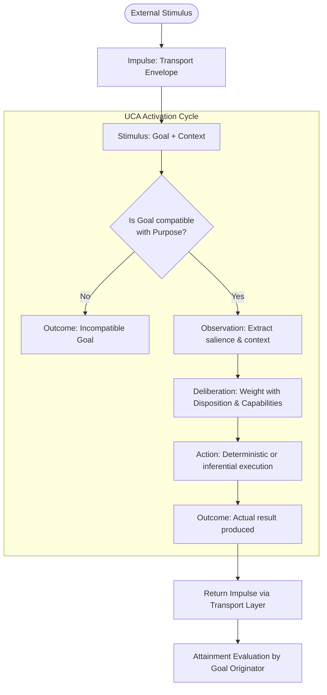

# UCA — Autonomous Cognitive Unit (Unidad Cognitiva Autónoma)

[](LICENSE)
[](SPECIFICATION.md)

[ English | [Español](README.es.md) ] &nbsp;•&nbsp; [ [Specification (EN)](SPECIFICATION.md) | [Especificación (ES)](SPECIFICATION.es.md) ]

> **A UCA is defined not by what it executes, but by the purpose it is responsible for fulfilling.**
>
> *Una UCA no se define por lo que ejecuta, sino por el propósito que es responsable de alcanzar.*

---

## 📖 Executive Summary

Many contemporary Artificial Intelligence agent architectures rely on a monolithic pattern:
```text
Input ──► Central State / Snapshot ──► Large Context Prompt ──► Central Model ──► Output
```
This pattern often concentrates disparate concerns into aggregate state objects and delegates deliberation, coordination, and error handling entirely to a single model inference.

The **UCA (Autonomous Cognitive Unit)** open specification explores an alternative decomposition principle:
- **Autonomy in Purpose**: Cognitive functionality is divided according to autonomous, bounded cognitive purposes (`Purpose`).
- **Reactivity in Execution**: No UCA self-activates; it executes strictly upon receiving a stimulus (`Stimulus = Goal + Context`).
- **Emergent Cognition**: Cognition does not reside in a single central unit or model; it **emerges from the causal, contextual interaction** among specialized units ($UCA_1, UCA_2, UCA_3$).
- **Structural Adaptation Without Retraining**: Interaction with the external environment yields evidence that allows supervisory units to diagnose deviations and adapt the behavioral predispositions (`Dispositions`) of target units, altering future behavior without modifying code or retraining model weights.

---

## ⚖️ Specification vs Implementation

This open specification defines the conceptual contract of an Autonomous Cognitive Unit.

**The specification deliberately defines**:
- What constitutes a UCA;
- How a UCA is activated;
- How it deliberates, executes actions, and produces outcomes;
- The invariants that govern composition and bounded scope.

**The specification does NOT prescribe**:
- A mandatory cognitive topology or hierarchy;
- Specific cognitive units that every system must instantiate;
- Biological or neuroanatomical analogies;
- A particular communication technology or message broker;
- A specific language model, framework, or vendor;
- A concrete memory or storage engine;
- A centralized global state representation;
- A specific runtime environment.

Systems may implement UCA concepts using diverse programming languages, actor models, event buses, distributed runtimes, local or remote language models, and varied architectural topologies. A reference project or runtime (such as Extensio) may implement the UCA abstraction, but UCA remains an independent open specification.

---

## 🏛️ Minimal Conceptual Model (UCA Core)

A UCA is persistently defined by:
```text
UCA
├── Purpose       (Why it exists — persistent, implementation-independent)
├── Disposition   (Behavioral predispositions — externally adaptable)
└── Capabilities  (Available resources: algorithms, tools, models, subordinate UCAs)
```

### The Canonical Activation Cycle

A UCA reacts strictly upon receiving a **Stimulus**:



---

## 📐 Core Concepts

| Concept | Definition |
|---|---|
| **Purpose** | Expresses **why a UCA exists**. Persistent, implementation-independent. |
| **Goal** | What **concrete outcome** must be achieved in a given activation. Contextual and transient. |
| **Stimulus** | The cognitive activation of a UCA. Composed of `Goal` and `Context`. |
| **Impulse** | The transport envelope across the communication layer (id, ttl, traceId, priority, stimulus/outcome). |
| **Context** | The bounded information necessary to interpret the Goal (prior outcomes, active evidence). |
| **Observation** | The cognitively relevant information extracted by the UCA from the input. |
| **Disposition** | Behavioral predispositions (ambiguity tolerance, confidence thresholds, error sensitivity). |
| **Capability** | Instrumental resources accessible to a UCA (algorithms, LLMs, drivers, tools, or **other UCAs**). |
| **Action** | What the UCA executes to satisfy the Goal under its Purpose. |
| **Outcome** | What the action **actually produced** (*belongs to the executor*). |
| **Attainment** | Degree to which the Outcome fulfills the Goal (*belongs to whoever set the Goal*). |

---

## 📜 Fundamental Principles

1. **Principle of Purpose**: A UCA exists because it possesses an autonomous, stable Purpose.
2. **Principle of Specialization**: A UCA only accepts Goals compatible with its Purpose.
3. **Principle of Reactivity**: No UCA self-activates; it executes strictly upon receiving a Stimulus.
4. **Principle of External Causality**: Every cognitive chain originates externally to the cognitive system.
5. **Principle of Composition**: A UCA can leverage another UCA as a Capability (recursive composition).
6. **Principle of Termination**: When autonomous purposes cease to emerge and only mechanisms remain, decomposition halts.
7. **Principle of Outcome**: A UCA produces Outcomes; it does not need to self-evaluate its global success.
8. **Principle of Attainment**: The Outcome belongs to the executor; the Attainment belongs to whoever set the Goal.
9. **Principle of Non-Self-Adaptation**: A UCA does not mutate its own Disposition; adaptation proceeds from an independent supervisory capability.
10. **Principle of Emergence**: Cognition does not reside in an individual UCA; it emerges from contextual interaction among units.
11. **Principle of Proactivity**: Autonomy resides in Purpose, reactivity in execution, and proactivity emerges from interaction.
12. **Principle of Representation**: Storing data produced by a cognitive capacity does not substitute the capacity to produce it.

---

## 🧭 Architecture Organization

The full specification is organized into three distinct tiers:

1. **[Part I: UCA Core](SPECIFICATION.md#part-i--uca-core)**: The minimal, invariant definition of a UCA, its activation cycle, disposition, action formulation, outcome production, and attainment evaluation.
2. **[Part II: Architectural Consequences & Composition Patterns](SPECIFICATION.md#part-ii--architectural-consequences--composition-patterns)**: Multi-UCA causal chains, the Impulse transport envelope, causal traceability, optional composition patterns (Coordinator, Supervisor, Identity, Memory), and dynamic context synthesis.
3. **[Part III: Experimental Hypotheses & Open Questions](SPECIFICATION.md#part-iii--experimental-hypotheses--open-questions)**: Emergent cognition, proactivity, behavioral adaptation loops, inter-unit relational plasticity (Synapses), and empirical validation criteria.

---

## 🎯 Empirical Validation Criteria

The UCA architecture is validated when a minimal ensemble of units can:
1. Receive an external stimulus;
2. React via specialized Purposes and collaborate without a monolithic central brain;
3. Produce an Outcome toward the external environment;
4. Receive external feedback/evidence regarding that Outcome;
5. Diagnose the deviation and adapt a `Disposition`;
6. **React differently and correctly in an equivalent future situation**;
7. Accomplish this **without source code modifications, without retraining models, and without ad-hoc test rules**.

---

## 📚 Complete Formal Specification

- 🇬🇧 **[SPECIFICATION.md (English)](SPECIFICATION.md)** — Exhaustive normative specification (RFC).
- 🇪🇸 **[SPECIFICATION.es.md (Español)](SPECIFICATION.es.md)** — Especificación formal completa en español.

---

## License

UCA Specification © 2026 Christian Marino Alvarez.

This specification and its documentation are licensed under the
Creative Commons Attribution 4.0 International License (CC BY 4.0).

You are free to use, share, adapt, and implement this specification,
including for commercial purposes, provided appropriate attribution
is given.

Software implementations and reference runtimes are licensed separately.
