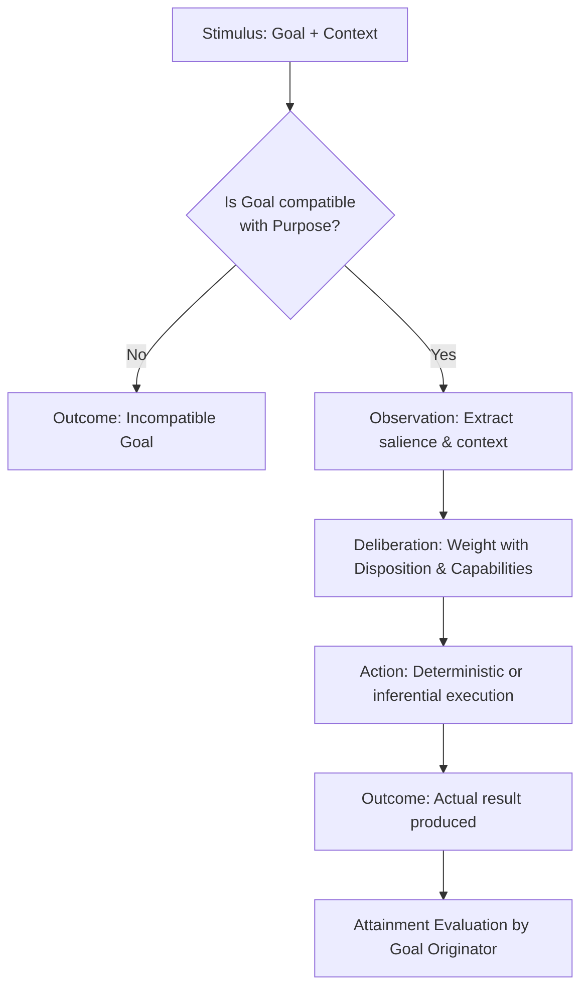

# UCA — Autonomous Cognitive Unit (Unidad Cognitiva Autónoma)

[](LICENSE)
[](SPECIFICATION.md)

[ English | [Español](README.es.md) ] &nbsp;•&nbsp; [ [Specification (EN)](SPECIFICATION.md) | [Especificación (ES)](SPECIFICATION.es.md) ]

> **A UCA is defined not by what it executes, but by the purpose it is responsible for fulfilling.**
>
> *Una UCA no se define por lo que ejecuta, sino por el propósito que es responsable de alcanzar.*

---

## 📖 Executive Summary

Many contemporary Artificial Intelligence agent architectures rely on a monolithic pattern:
```text
Input ──► Central State / Snapshot ──► Large Context Prompt ──► Central Model ──► Output
```
This pattern frequently concentrates disparate concerns into aggregate state objects and delegates planning, coordination, and error recovery entirely to single model inferences.

The **UCA (Autonomous Cognitive Unit)** open specification defines a minimal, purpose-driven abstraction:
- **Autonomy in Purpose**: Cognitive functionality is divided according to autonomous, bounded cognitive purposes (`Purpose`).
- **Reactivity in Execution**: A UCA executes strictly upon receiving an activating stimulus (`Stimulus = Goal + Context`).
- **Emergent Cognition**: Cognition is not tied to a single central model; it **emerges from the contextual interaction** among specialized units.
- **Structural Adaptation Without Retraining**: Dispositions can adapt in response to operational feedback, altering future behavior without modifying code or retraining model weights.

---

## 🏛️ The Three-Tier Architecture

To preserve a minimal, universal contract, the specification strictly separates three tiers:

```text
┌─────────────────────────────────────────────────────────────────┐
│                           UCA CORE                              │
│  Defines what a UCA is: identity, contracts, and activation.   │
│  U = (P, D, C)  |  S = (G, X)  |  compat(P, G)  |  O = F_U(S)   │
└────────────────────────────────┬────────────────────────────────┘
                                 │
                                 ▼
┌─────────────────────────────────────────────────────────────────┐
│                    COGNITIVE ARCHITECTURE                       │
│  Defines how a system organizes and composes multiple UCAs:     │
│  Coordination, supervision, state distribution, causality.     │
└────────────────────────────────┬────────────────────────────────┘
                                 │
                                 ▼
┌─────────────────────────────────────────────────────────────────┐
│                            RUNTIME                              │
│  Defines execution and transport infrastructure:                │
│  Impulse envelopes, messaging protocols, concurrency, tracing. │
└─────────────────────────────────────────────────────────────────┘
```

A functional unit is a UCA if and only if it satisfies the **UCA Core**. The Cognitive Architecture and the Runtime are implementation choices.

---

## ⚖️ Specification vs Implementation

This open specification defines the conceptual contract of an Autonomous Cognitive Unit.

**The specification deliberately defines**:
- What constitutes a UCA;
- How a UCA is activated;
- How it deliberates, executes actions, and produces outcomes;
- The invariants that govern composition and bounded scope.

**The specification does NOT prescribe**:
- A mandatory cognitive topology or hierarchy;
- Specific cognitive units that every system must instantiate;
- Biological or neuroanatomical analogies;
- A particular communication technology or message broker;
- A specific language model, framework, or vendor;
- A concrete memory or storage engine;
- A centralized global state representation;
- A specific runtime environment.

Systems may implement UCA concepts using diverse programming languages, actor models, event buses, distributed runtimes, local or remote language models, and varied architectural topologies.

---

## 🔬 Minimal Conceptual Model (UCA Core)

A UCA is persistently defined by:
```text
U = (P, D, C)
```
Where:
- **$P$ (Purpose)**: Why the UCA exists (stable, implementation-independent identity).
- **$D$ (Disposition)**: Behavioral predispositions (confidence thresholds, ambiguity tolerance, biases).
- **$C$ (Capabilities)**: Accessible resources (algorithms, tools, models, subordinate UCAs).

An activation is defined by:
```text
S = (G, X)
```
Where:
- **$G$ (Goal)**: Target outcome for this activation ($\text{compat}(P, G) = \text{true}$).
- **$X$ (Context)**: Contextual information required to interpret and achieve $G$.

Execution yields:
```text
O = F_U(S) = F(P, D, C, G, X)
```
Where:
- **$O$ (Outcome)**: What the executed action actually produced (*belongs to the executor*).

Attainment ($T$):
> The Outcome belongs to the executor.
> The Attainment belongs to the originator of the Goal.

### Canonical Activation Flow



---

## 📜 Foundational Invariants

1. **Principle of Purpose**: A UCA is defined by an autonomous, stable Purpose ($P$).
2. **Principle of Specialization**: A UCA only accepts Goals compatible with its Purpose ($\text{compat}(P, G) = \text{true}$).
3. **Principle of Local Reactivity**: No UCA self-activates; it executes strictly upon receiving a Stimulus ($S$).
4. **Principle of Composition**: A UCA can leverage another UCA as a Capability (recursive composition).
5. **Principle of Termination**: When autonomous purposes cease to emerge and only mechanisms remain, terminal capabilities have been reached.
6. **Principle of Outcome**: A UCA produces Outcomes; it does not evaluate its own global success.
7. **Principle of Attainment**: The Outcome belongs to the executor; the Attainment belongs to whoever set the Goal.
8. **Purpose Invariance**: A UCA cannot alter its own Purpose, as doing so destroys its functional identity.
9. **Principle of Representation**: Storing data produced by a cognitive capacity does not substitute the capacity to produce it.

---

## ✅ Minimal Conformance Criteria

A software component conforms to the **UCA Core** if and only if:

1. It defines an explicit, stable, implementation-independent **Purpose** ($P$).
2. It accepts **Goals** ($G$) only when compatible with its Purpose ($\text{compat}(P, G) = \text{true}$).
3. It executes strictly upon receiving an activating **Stimulus** ($S$).
4. It consumes the **Context** ($X$) required for its activation.
5. It operates using an explicit set of **Capabilities** ($C$).
6. Its reasoning or action selection may be conditioned by a **Disposition** ($D$).
7. It executes an **Action** ($A$) directed toward the Goal.
8. It produces an **Outcome** ($O$) representing what was achieved.
9. It treats another component as a UCA only if that component has its own autonomous Purpose.

**Non-requirements for conformance**: An implementation does *not* require an Impulse envelope, an Event Bus, an LLM, external causality, a global state snapshot, or a centralized coordinator/supervisor to conform to UCA.

---

## 📚 Complete Formal Specification

- 🇬🇧 **[SPECIFICATION.md (English)](SPECIFICATION.md)** — Exhaustive normative specification (RFC).
- 🇪🇸 **[SPECIFICATION.es.md (Español)](SPECIFICATION.es.md)** — Especificación formal completa en español.

---

## License

UCA Specification © 2026 Christian Marino Alvarez.

This specification and its documentation are licensed under the
Creative Commons Attribution 4.0 International License (CC BY 4.0).

You are free to use, share, adapt, and implement this specification,
including for commercial purposes, provided appropriate attribution
is given.

Software implementations and reference runtimes are licensed separately.
