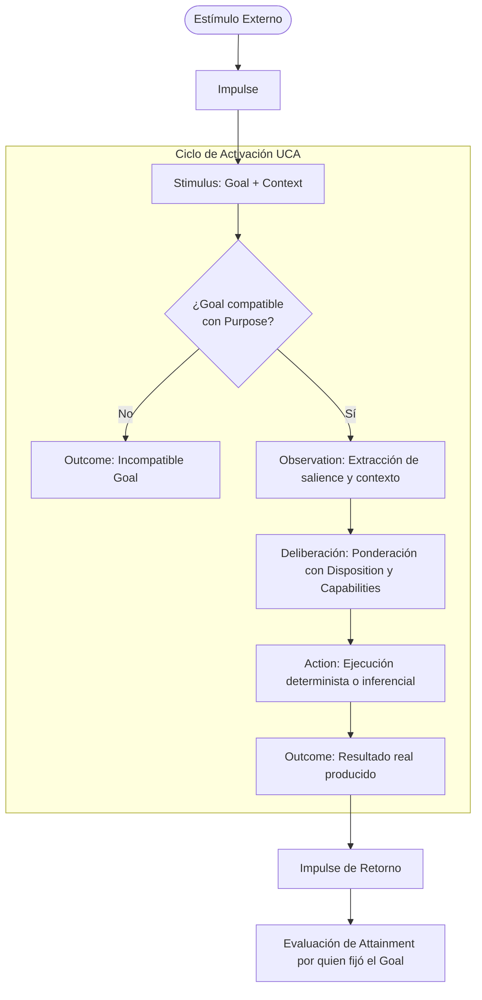

# UCA — Unidad Cognitiva Autónoma (Autonomous Cognitive Unit)

[](LICENSE)
[](SPECIFICATION.md)

> **Una UCA no se define por lo que ejecuta, sino por el propósito que es responsable de alcanzar.**
>
> *An Autonomous Cognitive Unit is defined not by the algorithm it executes, the model it uses, or the data it processes, but by why it exists within the cognitive system.*

---

## 📖 Resumen Ejecutivo / Executive Summary

Las arquitecturas de agentes de Inteligencia Artificial actuales suelen basarse en un modelo monolítico:
```text
Input ──► Big Snapshot / Memory ──► Giant Prompt ──► Central LLM ──► Output
```
Este enfoque confunde **mecanismos** con **capacidades cognitivas** y **datos** con **conocimiento**. Obliga a centralizar el estado en estructuras masivas e inflexibles y delega toda la deliberación, coordinación y aprendizaje a llamadas ciegas a modelos de lenguaje.

La arquitectura **UCA (Unidad Cognitiva Autónoma)** propone un cambio de paradigma:
- **Autonomía en el Purpose**: Cada unidad existe para cumplir un propósito cognitivo autónomo y estable.
- **Reactividad en la ejecución**: Ninguna UCA se autoactiva; solamente actúa ante un estímulo (`Stimulus`).
- **Cognición emergente**: La cognición no reside en una unidad central, en un snapshot ni en un LLM, sino que **emerge de la interacción causal y contextual** entre unidades especializadas.
- **Adaptación estructural sin reentrenamiento**: La interacción con el exterior genera evidencia que permite a unidades supervisoras diagnosticar desviaciones y adaptar las predisposiciones (`Dispositions`) de otras unidades, alterando su comportamiento futuro sin tocar código ni modificar los pesos del modelo.

---

## 🏛️ Modelo Conceptual Mínimo

Una UCA se compone persistentemente de:
```text
UCA
├── Purpose       (Por qué existe — persistente, independiente de la implementación)
├── Disposition   (Predisposiciones de comportamiento — adaptables externamente)
└── Capabilities  (Recursos disponibles: algoritmos, herramientas, modelos, otras UCAs)
```

### El Ciclo de Activación Canónico

Una UCA reacciona únicamente cuando recibe un **Estímulo**:



---

## 📐 Conceptos Clave

| Concepto | Definición |
|---|---|
| **Purpose** | Expresa **por qué existe** una UCA. Estable, independiente de una ejecución concreta. |
| **Goal** | Qué **resultado concreto** necesita obtenerse en una activación determinada. Contextual. |
| **Stimulus** | La activación cognitiva de una UCA. Contiene el `Goal` y el `Context`. |
| **Impulse** | El vehículo de transporte biológico/técnico del sistema nervioso (id, ttl, traceId, prioridad). |
| **Context** | La información relevante necesaria para interpretar el Goal (evidencias, outcomes previos). |
| **Observation** | La información cognitivamente relevante que la UCA extrae de la entrada. |
| **Disposition** | Predisposición de comportamiento (tolerancia a ambigüedad, umbrales de inferencia, etc.). |
| **Capability** | Recursos que una UCA puede invocar (algoritmos, LLMs, drivers, o incluso **otras UCAs**). |
| **Action** | La ejecución concreta que intenta satisfacer el Goal bajo su Purpose. |
| **Outcome** | Lo que **realmente produjo** la acción (*pertenece a quien ejecuta*). |
| **Attainment** | Grado en que el Outcome satisface la necesidad original (*pertenece a quien estableció el Goal*). |

---

## 📜 Principios Fundamentales

1. **Principio de Purpose**: Una UCA existe porque posee un propósito autónomo.
2. **Principio de Especialización**: Solo acepta Goals compatibles con su Purpose.
3. **Principio de Reactividad**: No existe autoactivación; solo ejecuta ante un Stimulus.
4. **Principio de Causalidad Externa**: Toda cadena cognitiva tiene un origen externo al sistema cognitivo.
5. **Principio de Composición**: Una UCA puede utilizar otra UCA como Capability (recursividad).
6. **Principio de Terminación**: Cuando dejan de aparecer propósitos autónomos y solo quedan mecanismos, se alcanzan capacidades terminales.
7. **Principio de Outcome**: Una UCA produce Outcomes; no necesita autoevaluarse globalmente.
8. **Principio de Attainment**: El Outcome pertenece a quien ejecuta; el Attainment a quien fijó el Goal.
9. **Principio de No Autoadaptación**: Una UCA no modifica su propia Disposition; la adaptación procede de otra capacidad con propósito de diagnóstico/adaptación (ej. Cíngulo).
10. **Principio de Emergencia**: La cognición emerge de la interacción contextual entre unidades.
11. **Principio de Proactividad**: La autonomía está en el Purpose, la reactividad en la ejecución y la proactividad emerge de la interacción encadenada.
12. **Principio de Representación**: Un dato almacenado no sustituye a la capacidad cognitiva de producirlo.

---

## 🎯 Criterio de Validación Empírica

La arquitectura UCA se valida si un conjunto reducido de unidades es capaz de:
1. Recibir un estímulo externo.
2. Reaccionar mediante Purposes especializados y colaborar sin un cerebro central monolítico.
3. Producir un Outcome hacia el exterior.
4. Recibir evidencia externa sobre ese Outcome (ej. corrección del usuario o error detectado).
5. Diagnosticar la desviación y adaptar una `Disposition`.
6. **Reaccionar de forma diferente y corregida ante una situación futura equivalente**.
7. Lograrlo **sin tocar código, sin reentrenar el modelo y sin reglas ad-hoc para el caso**.

---

## 📚 Documentación Completa

Para acceder a la especificación formal exhaustiva de 55 secciones, consulta:
👉 **[SPECIFICATION.md](SPECIFICATION.md)**

---

## 📄 Licencia

Este proyecto y su especificación se distribuyen bajo la licencia **MIT**. Consulta el archivo [LICENSE](LICENSE) para más detalles.
