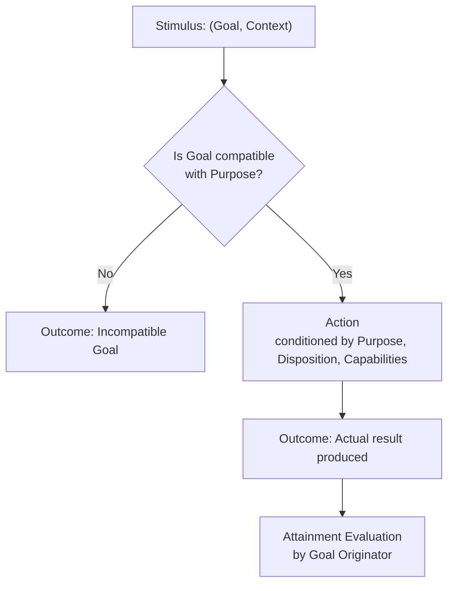

# UCA — Autonomous Cognitive Unit (Unidad Cognitiva Autónoma)

[](LICENSE)
[](SPECIFICATION.md)

[ English | [Español](README.es.md) ] &nbsp;•&nbsp; [ [Specification (EN)](SPECIFICATION.md) | [Especificación (ES)](SPECIFICATION.es.md) ]

> **A UCA is defined not by what it executes, but by the purpose it is responsible for fulfilling.**
>
> *Una UCA no se define por lo que ejecuta, sino por el propósito que es responsable de alcanzar.*

---

## 📖 Executive Summary

Many contemporary Artificial Intelligence agent architectures rely on a monolithic pattern:
```text
Input ──► Central State / Snapshot ──► Large Context Prompt ──► Central Model ──► Output
```
This pattern frequently concentrates disparate concerns into aggregate state objects and delegates planning, coordination, and error recovery entirely to single model inferences.

The **UCA (Autonomous Cognitive Unit)** open specification defines a minimal, purpose-driven abstraction:
- **Autonomy in Purpose**: Cognitive functionality is divided according to autonomous, bounded cognitive purposes (`Purpose`).
- **Reactivity in Execution**: A UCA executes strictly upon receiving an activating stimulus (`Stimulus = Goal + Context`).
- **Emergent Behaviour (Hypothesis)**: Cognitive behaviour may emerge from the contextual interaction of purpose-bounded units. This is a hypothesis to be validated experimentally, not a demonstrated property.
- **Structural Adaptation Without Retraining**: Dispositions can adapt in response to operational feedback, altering future behaviour without modifying code or retraining model weights.

---

## 🧩 From Primitive to Emergent Behaviour

> **UCA is not cognition.**
>
> **UCA is a minimal functional primitive proposed for composing systems in which cognitive behaviour may emerge.**

```text
┌──────────────────────────────┐
│             UCA              │  ← functional primitive (normative)
│  U = (P, D, C)              │
│  (U, S) → A → O             │
└──────────────┬───────────────┘
               │ composition
               ▼
┌──────────────────────────────┐
│          UCA SYSTEM          │  ← network of functional primitives
│   U₁ ↔ U₂ ↔ ... ↔ Uₙ       │
└──────────────┬───────────────┘
               │ organization
               ▼
┌──────────────────────────────┐
│    COGNITIVE ARCHITECTURE    │  ← organization of primitives
└──────────────┬───────────────┘
               │ executed by
               ▼
┌──────────────────────────────┐
│           RUNTIME            │  ← execution infrastructure
└──────────────────────────────┘
```

And separately, as a research hypothesis:

```text
UCA SYSTEM
    │
    │ experimental hypothesis
    ▼
EMERGENT COGNITIVE BEHAVIOUR
```

---

## ⚖️ Specification vs Implementation

This open specification defines the conceptual contract of an Autonomous Cognitive Unit.

**The specification deliberately defines**:
- What constitutes a UCA;
- How a UCA is activated;
- How it performs an Action and produces an Outcome;
- The invariants that govern composition and bounded scope.

**The specification does NOT prescribe**:
- A mandatory cognitive topology or hierarchy;
- Specific cognitive units that every system must instantiate;
- Biological or neuroanatomical analogies;
- A particular communication technology or message broker;
- A specific language model, framework, or vendor;
- A concrete memory or storage engine;
- A centralized global state representation;
- A specific runtime environment;
- That any individual UCA possesses or demonstrates cognition.

---

## 🔬 Minimal Conceptual Model (UCA Core)

A UCA is persistently defined by:
```text
U = (P, D, C)
```
Where:
- **`P` (Purpose)**: Why the UCA exists — stable, implementation-independent identity.
- **`D` (Disposition)**: Parameters conditioning how the UCA uses its capabilities to fulfill its Purpose (e.g., operational thresholds, framing granularity).
- **`C` (Capabilities)**: Accessible resources (algorithms, tools, models, other UCAs). A UCA may use other UCAs as Capabilities when their autonomous Purposes provide functionality required by its Action. Composition is recursive and does not require a central coordinator.

An activation is defined by:
```text
S = (G, X)
```
Where:
- **`G` (Goal)**: Target outcome for this activation. A Goal must be compatible with the Purpose.
- **`X` (Context)**: Contextual information required to interpret and achieve `G`.

The minimal activation model:
```text
(U, S) → A → O
```
Where:
- **`A` (Action)**: What the UCA performs, conditioned by Purpose, Disposition, Capabilities, Goal and Context.
- **`O` (Outcome)**: What the Action actually produced (*belongs to the executor*).

> The Outcome belongs to the executor.
> The Attainment belongs to the originator of the Goal.

### Canonical Activation Flow



---

## 📜 Foundational Invariants

1. **Principle of Purpose**: A UCA is defined by an autonomous, stable Purpose (`P`).
2. **Principle of Specialization**: A UCA only accepts Goals compatible with its Purpose.
3. **Principle of Local Reactivity**: No UCA self-activates; it executes strictly upon receiving a Stimulus (`S`).
4. **Principle of Composition**: A UCA can leverage another UCA as a Capability (recursive composition).
5. **Principle of Termination**: When autonomous purposes cease to emerge and only mechanisms remain, terminal capabilities have been reached.
6. **Principle of Outcome**: A UCA produces Outcomes; it does not evaluate its own global success.
7. **Principle of Attainment**: The Outcome belongs to the executor; the Attainment belongs to whoever originated the Goal.
8. **Purpose Invariance**: A UCA cannot alter its own Purpose, as doing so destroys its functional identity.
9. **Principle of Representation**: Storing data produced by a cognitive capacity does not substitute the capacity to produce it.
10. **Minimality Principle**: A concept belongs to the UCA Core only if removing it prevents the unit from satisfying the universal UCA contract.
11. **Composition Principle**: Before extending the UCA primitive, attempt to represent the required cognitive functionality through composition of existing UCAs.

---

## ✅ Minimal Conformance Criteria

A software component conforms to the **UCA Core** if and only if:

1. It defines an explicit, stable, implementation-independent **Purpose** (`P`).
2. It has a **Disposition** (`D`) that conditions its behaviour.
3. It operates using an explicit set of **Capabilities** (`C`).
4. It executes strictly upon receiving an activating **Stimulus** (`S`).
5. The Stimulus contains a **Goal** (`G`) and a **Context** (`X`).
6. It accepts Goals only when compatible with its **Purpose**.
7. It performs an **Action** (`A`) directed toward the Goal within its Purpose.
8. It produces an **Outcome** (`O`) representing what was achieved.
9. It treats another component as a UCA only if that component has its own autonomous Purpose.

**Non-requirements for conformance**: An implementation does *not* require Observation or Perception as lifecycle phases, Memory, Identity, Learning, Adaptation, a Coordinator, Dispatcher, Orchestrator or Supervisor, an LLM, external causality, an Impulse envelope, an Event Bus, a global state snapshot, Synapses, or demonstrated emergent cognitive behaviour to conform to UCA.

Conformance evaluates the **individual unit** against the UCA contract. It does not evaluate whether the system as a whole exhibits cognitive behaviour.

---

## 🔬 The Falsifiable Hypothesis

> **Can cognitive behaviour emerge from the interaction of purpose-bounded UCAs while each individual unit remains structurally limited to `U = (P, D, C)` and behaviourally limited to `(U, S) → A → O`?**

This is the central experimental question UCA poses. It is to be evaluated through future implementations and empirical observation.

---

## 📚 Complete Formal Specification

- 🇬🇧 **[SPECIFICATION.md (English)](SPECIFICATION.md)** — Exhaustive normative specification (RFC).
- 🇪🇸 **[SPECIFICATION.es.md (Español)](SPECIFICATION.es.md)** — Especificación formal completa en español.

---

## License

UCA Specification © 2026 Christian Marino Alvarez.

This specification and its documentation are licensed under the
Creative Commons Attribution 4.0 International License (CC BY 4.0).

You are free to use, share, adapt, and implement this specification,
including for commercial purposes, provided appropriate attribution is given.

Software implementations and reference runtimes are licensed separately.
